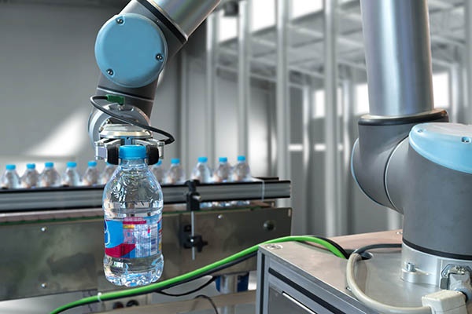
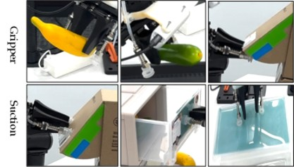

# ● Smart Pick and Place Robot

MEC483 - Mechatronic System Design 

# ● Team Members

- Maher Abo Abed
- Sabeeha Zainab Hasham
- Basel Feras Ghunaim  
- Ahmed Nasser Alshehhi  

# ● Problem Statement

Modern industries increasingly rely on automation for sorting and handling tasks, yet many existing pick-and-place systems are limited in flexibility and adaptability. Traditional systems are often designed to handle a single type of object or require precise positioning, making them inefficient when dealing with objects of varying shapes, sizes, and fragility such as bolts, eggs, or flat items like CDs.
 
This limitation creates a significant gap in applications where diverse objects must be handled within the same system, such as small-scale manufacturing, educational platforms, and adaptable production environments. Additionally, many systems lack integrated vision capabilities, reducing their ability to operate autonomously in dynamic or unstructured environments.
 
As a result, there is a need for a more versatile and intelligent pick-and-place solution that can accurately detect, classify, and manipulate different types of objects without manual intervention. Addressing this gap will improve efficiency, reduce human involvement, and demonstrate the potential of integrating mechanical systems with vision-based intelligence in modern mechatronic applications.

# ● Abstract
This project addresses the growing need for efficient and intelligent automation in object sorting and handling tasks. Many existing systems lack flexibility when dealing with objects of different shapes, sizes, and fragility, creating a demand for more adaptable pick-and-place robotic solutions.
To address this challenge, this project focuses on the design and development of a smart, autonomous pick-and-place robot capable of identifying, picking, and placing various objects such as bolts, nuts, eggs, stress balls, and CDs into designated locations. The system integrates a camera and a Raspberry Pi to enable vision-based object detection, eliminating the need for manual intervention and allowing for intelligent, real-time decision-making. A hybrid end-effector combining mechanical gripping and vacuum suction is used to enhance versatility and reliability when handling diverse objects.
The development follows a structured engineering methodology, progressing from system definition to advanced implementation stages. The robot integrates mechanical design, electrical systems, and control engineering, including stepper motors, sensors, Arduino-based control, and AI-supported vision processing. The design process is supported through CAD modeling, component selection, and iterative prototyping.
The expected outcome is a fully integrated mechatronic pick-and-place robotic system capable of autonomous operation with improved accuracy, efficiency, and adaptability. This project demonstrates the integration of mechanical, electrical, and intelligent systems, reflecting real-world applications in modern industrial automation.

# ● Background - Literature Review

Pick-and-place robots are widely used in modern industrial applications such as assembly lines, packaging systems, warehouses, and automated sorting environments. These systems improve productivity, precision, and safety by reducing repetitive human involvement and increasing operational efficiency. However, many conventional pick-and-place robots are designed for specific tasks and struggle when handling objects with different shapes, sizes, surface properties, and fragility.

Figure 1: Industrial pick and place robot.
 
A major challenge in robotic manipulation is the design of the end effector, since it directly determines what kinds of objects the robot can handle. Traditional parallel grippers are commonly used because they are simple, effective, and easy to control. They can grasp many rigid objects, but they are limited when dealing with very thin, fragile, flat, or handleless objects. On the other hand, vacuum suction systems are highly effective for flat and smooth surfaces, but they perform poorly on porous, irregular, or non-sealable materials. Because of these limitations, recent research has explored multi-functional and hybrid end-effectors that combine gripping and suction in one design.
 
Previous work in this area has shown the value of hybrid manipulation systems. One important example is a recent study proposing a low-cost integrated end-effector that combines a two-finger gripper with a vacuum suction unit. That work was developed to overcome the limitations of standard grippers in tasks such as opening handleless drawers, lifting thin glass-like objects, and manipulating boxes or containers. The researchers showed that hybrid end-effectors can perform tasks that are not feasible with conventional grippers alone. Their results demonstrated successful operation in several complex tasks, highlighting how the combination of suction and gripping significantly improves manipulation flexibility and task range.
 
The same study also emphasized that robotic performance is not only dependent on intelligent control models, but also strongly constrained by the physical hardware, especially the end-effector design. This is highly relevant to our project, since our pick-and-place robot also aims to handle a variety of objects using a hybrid gripper and suction mechanism. Their work provides strong support for the idea that combining multiple gripping methods leads to more adaptable and capable robotic systems.

Figure 2: Hybrid coaxial suction and gripper end-effector.
 
In addition to hardware design, recent advancements in mechatronics and intelligent robotics have enabled the integration of mechanical systems, electronics, embedded control, and computer vision into a single platform. Robotic arms commonly use actuators such as stepper motors and servos for position control, while microcontrollers and embedded computers such as Arduino and Raspberry Pi are used for coordination, sensing, and processing. At the same time, vision-guided robotics has become increasingly important. By integrating cameras with computer vision and artificial intelligence techniques, robots can identify, classify, and locate objects in real time, allowing more autonomous and adaptive operation.
 
This project builds on these technical foundations by developing a pick-and-place robot that integrates mechanical gripping, vacuum suction, sensors, camera-based detection, and embedded control into one mechatronic system. The literature shows that hybrid end-effectors and intelligent perception systems are essential for improving robot flexibility, especially in tasks involving diverse objects. Therefore, this project extends previous work by applying these ideas to the design of a versatile robotic system capable of sorting and handling multiple object types in an autonomous manner.

# ● Methods
The project follows a structured engineering approach that moves from design to validation. It begins with system design, where the overall concept is developed and refined based on practical requirements and existing solutions. This is followed by simulation and analysis, where tools like SolidWorks are used to evaluate performance and ensure the design meets mechanical and functional needs. The system is then brought to life through prototyping and fabrication, using methods such as 3D printing and laser cutting to enable rapid iteration. Finally, electronics and control are integrated, combining hardware and software to achieve reliable operation. This step-by-step process allows for continuous improvement, ensuring the final system is both functional and efficient.

○[System Design](System_Design.md)

○[Simulation and Analysis](Simulation_and_Analysis.md)

○[Prototyping and Fabrication](Prototyping_and_Fabrication.md)

○[Electronics and Control](Hardware_Integration.md)

# ● Computer Vision (Object Detection)
○ [HSV and Colour Detection](Object_detection.md)

# ● Testing and Validation
This section is still under development and will be refined as the project progresses. The approach will follow a systematic and iterative process, where testing, data collection, and analysis guide improvements. Experiments will be conducted to evaluate system performance, with results used to inform design adjustments and optimize functionality. The overall workflow will follow a build–measure–learn cycle, allowing continuous refinement based on real-world observations and performance data.

○ [Testing Procedure](Testing_Procedure.md)

○ [Data Collection](Data_Collection.md)

○ [Evaluation Criteria](Evaluation_Criteria.md)

# ● Results

The project has progressed through several key development stages, including system design, simulation, and initial prototyping efforts. Major components such as the sensing system, motor selection, and vacuum-based end effector have been successfully analyzed and validated through calculations and decision-making frameworks. :contentReference[oaicite:0]{index=0}

Mechanical analysis performed in SolidWorks confirmed that the required joint torques fall within the operating range of the selected actuators, supporting the feasibility of the design. Additionally, CAD models were completed and refined, with STL files prepared for fabrication and initial 3D printing processes underway. :contentReference[oaicite:1]{index=1}

On the software side, computer vision capabilities were explored using both classical and deep learning approaches. HSV-based color detection and shape detection using OpenCV were successfully implemented for basic object recognition. More advanced detection was achieved by training a YOLOv8 model on labeled image data, which demonstrated real-time object detection capability. :contentReference[oaicite:2]{index=2}

Kinematic modeling was also initiated using ROS 2 tools, where a URDF model of the robot was created and imported into RViz and MoveIt2. This enabled preliminary testing of forward and inverse kinematics, providing a foundation for future motion planning and control. :contentReference[oaicite:3]{index=3}

### Key Results Summary

| Component | Status | Outcome |
|----------|--------|--------|
| CAD Design | Completed | Validated geometry and structure |
| Torque Analysis | Completed | Confirmed motor selection is sufficient |
| Computer Vision (HSV) | Completed | Basic object detection achieved |
| Computer Vision (YOLOv8) | In Progress / Tested | Real-time detection demonstrated |
| ROS 2 (FK/IK) | In Progress | URDF model working in RViz |
| Fabrication | Started | 3D printing initiated |

# ● Discussion

Interpret the results. Discuss:
- what worked
- what did not
- limitations
- lessons learned
- possible future improvements

# ● Project Management Summary
The project was organized using a structured team-based approach. Tasks were divided among members based on key areas such as mechanical design, sensors, and control systems.
 
The team followed clear milestones, starting from research and concept development to CAD design and preparation for prototyping. Regular meetings were held to track progress, discuss challenges, and make design decisions.
 
Strong teamwork and communication allowed effective collaboration and integration of all system components. The project is currently progressing from the design phase to prototyping and testing.

## ○ Gantt Chart
[View the updated Gantt Chart](https://studentsaduac-my.sharepoint.com/:x:/g/personal/1087993_students_adu_ac_ae/IQCVl5X-gnVOTbJbda9AOzVBAQxvkQVJ4Exoq-0edEJwLJE?e=tAfXTX&wdLOR=cD9B9CDF9-E9B2-46DC-981F-AE0154DF6142)

# ● Appendix
○[Progress Report - Week 2](Files/Progress-W2.pdf)

○[Progress Report - Week 3](Files/Progress-W3.pdf)

○[Progress Report - Week 4](File/Progress-W4.pdf)

○[Progress Report - Week 5](Files/Progress-W5.pdf)
