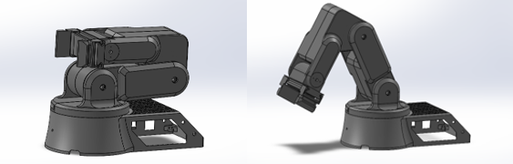
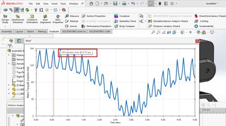

# ● Title

**Project Name:** _Smart Pick and Place Robot_


# ● Team Members

- Maher Abo Abed
- Sabeeha Zainab Hasham
- Basel Feras Ghunaim  
- Ahmed Nasser Alshehhi  


# ● Problem Statement

Modern industries increasingly rely on automation for sorting and handling tasks, yet many existing pick-and-place systems are limited in flexibility and adaptability. Traditional systems are often designed to handle a single type of object or require precise positioning, making them inefficient when dealing with objects of varying shapes, sizes, and fragility such as bolts, eggs, or flat items like CDs.
 
This limitation creates a significant gap in applications where diverse objects must be handled within the same system, such as small-scale manufacturing, educational platforms, and adaptable production environments. Additionally, many systems lack integrated vision capabilities, reducing their ability to operate autonomously in dynamic or unstructured environments.
 
As a result, there is a need for a more versatile and intelligent pick-and-place solution that can accurately detect, classify, and manipulate different types of objects without manual intervention. Addressing this gap will improve efficiency, reduce human involvement, and demonstrate the potential of integrating mechanical systems with vision-based intelligence in modern mechatronic applications.


# ● Abstract
This project addresses the growing need for efficient and intelligent automation in object sorting and handling tasks. Many existing systems lack flexibility when dealing with objects of different shapes, sizes, and fragility, creating a demand for more adaptable pick-and-place robotic solutions.
 
To address this challenge, this project focuses on the design and development of a smart, autonomous pick-and-place robot capable of identifying, picking, and placing various objects such as bolts, nuts, eggs, stress balls, and CDs into designated locations. The system integrates a camera and a Raspberry Pi to enable vision-based object detection, eliminating the need for manual intervention and allowing for intelligent, real-time decision-making. A hybrid end-effector combining mechanical gripping and vacuum suction is used to enhance versatility and reliability when handling diverse objects.
 
The development follows a structured engineering methodology, progressing from system definition to advanced implementation stages. The robot integrates mechanical design, electrical systems, and control engineering, including stepper motors, sensors, Arduino-based control, and AI-supported vision processing. The design process is supported through CAD modeling, component selection, and iterative prototyping.
 
The expected outcome is a fully integrated mechatronic pick-and-place robotic system capable of autonomous operation with improved accuracy, efficiency, and adaptability. This project demonstrates the integration of mechanical, electrical, and intelligent systems, reflecting real-world applications in modern industrial automation.


# ● Background - Literature Review

Pick-and-place robots are widely used in modern industrial applications such as assembly lines, packaging systems, warehouses, and automated sorting environments. These systems improve productivity, precision, and safety by reducing repetitive human involvement and increasing operational efficiency. However, many conventional pick-and-place robots are designed for specific tasks and struggle when handling objects with different shapes, sizes, surface properties, and fragility.
 
A major challenge in robotic manipulation is the design of the end effector, since it directly determines what kinds of objects the robot can handle. Traditional parallel grippers are commonly used because they are simple, effective, and easy to control. They can grasp many rigid objects, but they are limited when dealing with very thin, fragile, flat, or handleless objects. On the other hand, vacuum suction systems are highly effective for flat and smooth surfaces, but they perform poorly on porous, irregular, or non-sealable materials. Because of these limitations, recent research has explored multi-functional and hybrid end-effectors that combine gripping and suction in one design.
 
Previous work in this area has shown the value of hybrid manipulation systems. One important example is a recent study proposing a low-cost integrated end-effector that combines a two-finger gripper with a vacuum suction unit. That work was developed to overcome the limitations of standard grippers in tasks such as opening handleless drawers, lifting thin glass-like objects, and manipulating boxes or containers. The researchers showed that hybrid end-effectors can perform tasks that are not feasible with conventional grippers alone. Their results demonstrated successful operation in several complex tasks, highlighting how the combination of suction and gripping significantly improves manipulation flexibility and task range.
 
The same study also emphasized that robotic performance is not only dependent on intelligent control models, but also strongly constrained by the physical hardware, especially the end-effector design. This is highly relevant to our project, since our pick-and-place robot also aims to handle a variety of objects using a hybrid gripper and suction mechanism. Their work provides strong support for the idea that combining multiple gripping methods leads to more adaptable and capable robotic systems.
 
In addition to hardware design, recent advancements in mechatronics and intelligent robotics have enabled the integration of mechanical systems, electronics, embedded control, and computer vision into a single platform. Robotic arms commonly use actuators such as stepper motors and servos for position control, while microcontrollers and embedded computers such as Arduino and Raspberry Pi are used for coordination, sensing, and processing. At the same time, vision-guided robotics has become increasingly important. By integrating cameras with computer vision and artificial intelligence techniques, robots can identify, classify, and locate objects in real time, allowing more autonomous and adaptive operation.
 
This project builds on these technical foundations by developing a pick-and-place robot that integrates mechanical gripping, vacuum suction, sensors, camera-based detection, and embedded control into one mechatronic system. The literature shows that hybrid end-effectors and intelligent perception systems are essential for improving robot flexibility, especially in tasks involving diverse objects. Therefore, this project extends previous work by applying these ideas to the design of a versatile robotic system capable of sorting and handling multiple object types in an autonomous manner.


# ● Methods

## ○ System Design

### ● Concept Development
The concept development process was iterative and systematic, building on existing literature and proven industrial designs rather than trying to reinvent the wheel. The goal was to adapt known pick-and-place mechanisms into a compact, efficient system that meets our specific needs. Throughout the design process, we focused on keeping the structure simple, durable, and practical, while also making sure it could be manufactured easily and affordably in a lab setting using tools like laser cutting and 3D printing. Another key consideration was compatibility with widely available, off-the-shelf components such as MG995 servo motors and Arduino-based control systems, which helped keep costs low and integration straightforward. Design decisions were guided by requirements like strength, reliability, and repeatability, while working within constraints such as limited resources and fabrication methods. The end result is a compact, robust design that can withstand repeated use without compromising performance.

### ● CAD Modeling

- [CAD (SolidWorks) ](CAD_SolidWorks.zip)
- [STEP File](assembly.STEP)


## ○ Simulation and Analysis

### ● Mechanical
A mechanical analysis was performed in SolidWorks Motion Study to estimate the required torque at each joint throughout the robot’s movement. The simulation incorporated gravity effects and defined motor-driven joints to replicate realistic operating conditions. A predefined motion profile was applied to guide the arm through a representative pick-and-place cycle, allowing the software to compute the dynamic loads and torque demands over time. The results show peak torque values of approximately 165 N·mm at critical points in the motion. These values fall within the operating capabilities of the selected MG995 servo motors, confirming that the motor selection is appropriate for the intended application. Overall, the analysis validates that the system can operate reliably without overloading the actuators.


### ● Kinematics (FK and IK)
Forward kinematics (FK) was implemented and visualized in RViz using ROS 2 to model the robot’s motion and verify link transformations. By defining the robot’s geometry and joint relationships, the end-effector position could be determined for given joint angles, allowing us to confirm that the arm reaches the desired workspace and behaves as expected. This also helped with debugging the overall structure and ensuring consistency between the CAD model and the software representation. In addition to FK, inverse kinematics (IK) will be implemented to enable the robot to compute the required joint angles for a desired end-effector position. This will allow for more intuitive control of the system, particularly for pick-and-place tasks where target positions are defined in Cartesian space.


### ● Performance Evaluation
Discuss expected performance based on simulations.


## ○ Prototyping and Fabrication

### ● Manufacturing Process
Explain how parts were made:
- 3D printing
- CNC machining
- Laser cutting
- Off-the-shelf components

### ● Assembly
Describe how components were put together.


## ○ Electronics and Control

### ● Hardware Integration
The robotic system is built around a combination of a Raspberry Pi and an Arduino, which together enable both high-level processing and low-level control. The Raspberry Pi is responsible for vision processing, object detection, and decision-making using camera input, while the Arduino handles real-time control of the actuators by generating PWM signals for the motors. Communication between the two controllers is achieved through serial communication (USB or UART), allowing coordinated system operation.

The actuation system is based on multiple servo motors selected according to torque and functional requirements. MG995 servo motors (270° rotation) are used for standard joints, providing sufficient torque for base and intermediate movements. For heavier joints such as the elbow, a 20 kg·cm high-torque servo motor (270° rotation) is used to ensure stability and lifting capability. The gripper mechanism is controlled using an SG90 micro servo (180° rotation), which offers lightweight and precise motion for opening and closing actions. All motors are controlled using PWM signals from the Arduino, and no external encoders are required since the servos include built-in potentiometers, enabling closed-loop position control.

For sensing and object detection, the system integrates a camera connected to the Raspberry Pi. The current design considers either the Raspberry Pi Camera Module, which offers seamless integration and low latency, or a smartphone camera as an alternative for higher image quality. The camera provides real-time visual feedback, which is processed using computer vision and AI techniques to identify and locate objects for pick-and-place operations.

In terms of hardware layout and wiring, the servo motors are connected to the Arduino’s PWM pins and powered using an external power supply to ensure stable operation and prevent overloading the control board. The Raspberry Pi interfaces directly with the camera and communicates with the Arduino to send control commands based on processed visual data. This architecture allows efficient integration of mechanical, electronic, and intelligent subsystems, resulting in a flexible and scalable mechatronic system.


### ● Object detection
- HSV and colour detection.
 This was used for objects like the ball to easily classify them, this makes it easier to isolate specific colours under different lighting conditions. In the project, the camera feed was converted to HSV using OpenCV, and a colour range (upper and lower HSV values) was defined to create a mask that highlights only the desired colour. This mask was then used to detect and track objects of that colour in real time.

- Training a yolov8 model
The classification process involved training a custom object detection model using YOLOv8 within PyCharm. First, image data for the objects was collected, labeled, and organized into training folders with corresponding annotation files. A configuration file (config.yaml) was created to define the dataset paths and class names. The model was then trained over multiple epochs, where it repeatedly processed the images, compared its predictions to the actual labels, and adjusted its internal parameters to improve accuracy. Performance metrics such as precision and recall were used to evaluate how well the model was learning. Finally, the trained model was tested using a live camera feed, where each frame was processed in real time, detections were made based on confidence thresholds, and bounding boxes with labels were displayed on the screen.


## ○ Testing and Validation

### ● Testing Procedure
Describe how the system was tested.

### ● Data Collection
Explain what data was measured and how.

### ● Evaluation Criteria
Define how success was determined.


# ● Results

Present measurements, observations, graphs, tables, screenshots, or performance outcomes.

Example:

| Metric | Target | Actual |
|--------|--------|--------|
| Response Time | 2 s | 1.8 s |
| Accuracy | 95% | 96.2% |
| Power Use | < 10 W | 8.7 W |


# ● Discussion

Interpret the results. Discuss:
- what worked
- what did not
- limitations
- lessons learned
- possible future improvements


# ● Project Management Summary
The project was organized using a structured team-based approach. Tasks were divided among members based on key areas such as mechanical design, sensors, and control systems.
 
The team followed clear milestones, starting from research and concept development to CAD design and preparation for prototyping. Regular meetings were held to track progress, discuss challenges, and make design decisions.
 
Strong teamwork and communication allowed effective collaboration and integration of all system components. The project is currently progressing from the design phase to prototyping and testing.

## ○ Gantt Chart *Updated*
Add your updated Gantt chart here.

```text
[Insert image or link to MS Project export here]
