# ● Smart Pick and Place Robot

MEC483 - Mechatronic System Design

# ● Team Members

- [Maher Abo Abed](https://maherrrrr99.github.io/maherrrrr99/)
- [Sabeeha Zainab Hasham](https://sabeehahasham.github.io/)
- [Basel Feras Ghunaim](https://basel-ghunaim.github.io/)
- [Ahmed Nasser Alshehhi](https://ahmed1090822.github.io/Ahmed109.github.io/)

---

# ● Problem Statement

Modern industries increasingly rely on automation for sorting and handling tasks, yet many existing pick-and-place systems are limited in flexibility and adaptability. Traditional systems are often designed to handle a single type of object or require precise positioning, making them inefficient when dealing with objects of varying shapes, sizes, and fragility such as bolts, eggs, or flat items like CDs.

This limitation creates a significant gap in applications where diverse objects must be handled within the same system, such as small-scale manufacturing, educational platforms, and adaptable production environments. Additionally, many systems lack integrated vision capabilities, reducing their ability to operate autonomously in dynamic or unstructured environments.

As a result, there is a need for a more versatile and intelligent pick-and-place solution that can accurately detect, classify, and manipulate different types of objects without manual intervention. Addressing this gap will improve efficiency, reduce human involvement, and demonstrate the potential of integrating mechanical systems with vision-based intelligence in modern mechatronic applications.

---

# ● Abstract

This project addresses the growing need for efficient and intelligent automation in object sorting and handling tasks. Many existing systems lack flexibility when dealing with objects of different shapes, sizes, and fragility, creating a demand for more adaptable pick-and-place robotic solutions.

To address this challenge, this project focuses on the design and development of a smart, autonomous pick-and-place robot capable of identifying, picking, and placing various objects such as bolts, nuts, eggs, stress balls, and CDs into designated locations. The system integrates a camera and a Raspberry Pi to enable vision-based object detection, eliminating the need for manual intervention and allowing for intelligent, real-time decision-making. A hybrid end-effector combining mechanical gripping and vacuum suction is used to enhance versatility and reliability when handling diverse objects.

The development follows a structured engineering methodology, progressing from system definition to advanced implementation stages. The robot integrates mechanical design, electrical systems, and control engineering, including stepper motors, sensors, Arduino-based control, and AI-supported vision processing. The design process is supported through CAD modeling, component selection, and iterative prototyping.

The expected outcome is a fully integrated mechatronic pick-and-place robotic system capable of autonomous operation with improved accuracy, efficiency, and adaptability. This project demonstrates the integration of mechanical, electrical, and intelligent systems, reflecting real-world applications in modern industrial automation.

---

# ● The Robot

The final system is a 4-DOF robotic arm mounted on a motorized mobile platform. The arm integrates a hybrid end-effector capable of both mechanical gripping and vacuum suction, allowing it to handle a wide variety of objects. A Raspberry Pi processes camera input using YOLOv8 object detection, communicates with a laptop for heavier inference, and sends control commands to an Arduino which drives the servo motors and suction pump in real time.

<p align="center">
  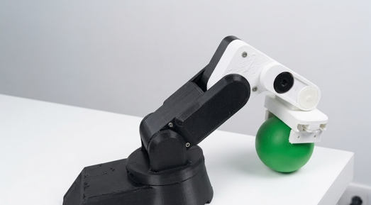
</p>
<p align="center"><em>Figure: Assembled robotic arm</em></p>

<p align="center">
  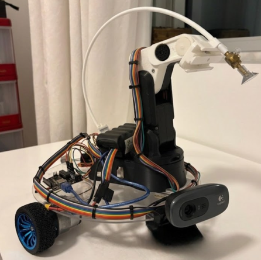
</p>
<p align="center"><em>Figure: Arm mounted on the motorized platform</em></p>

<p align="center">
  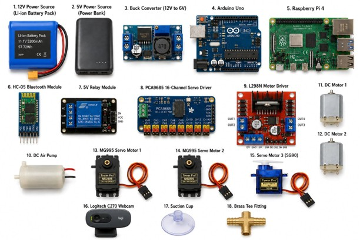
</p>
<p align="center"><em>Figure: Full hardware setup</em></p>

---

# ● Background - Literature Review

Pick-and-place robots are widely used in modern industrial applications such as assembly lines, packaging systems, warehouses, and automated sorting environments. These systems improve productivity, precision, and safety by reducing repetitive human involvement and increasing operational efficiency. However, many conventional pick-and-place robots are designed for specific tasks and struggle when handling objects with different shapes, sizes, surface properties, and fragility.

<p align="center">
  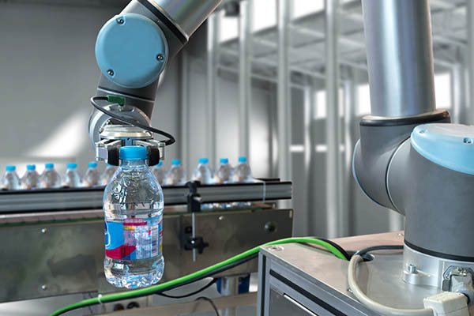
</p>
<p align="center"><em>Figure: Industrial Pick-and-Place Robot</em></p>

A major challenge in robotic manipulation is the design of the end effector, since it directly determines what kinds of objects the robot can handle. Traditional parallel grippers are commonly used because they are simple, effective, and easy to control. They can grasp many rigid objects, but they are limited when dealing with very thin, fragile, flat, or handleless objects. On the other hand, vacuum suction systems are highly effective for flat and smooth surfaces, but they perform poorly on porous, irregular, or non-sealable materials. Because of these limitations, recent research has explored multi-functional and hybrid end-effectors that combine gripping and suction in one design.

Previous work in this area has shown the value of hybrid manipulation systems. One important example is a recent study proposing a low-cost integrated end-effector that combines a two-finger gripper with a vacuum suction unit. That work was developed to overcome the limitations of standard grippers in tasks such as opening handleless drawers, lifting thin glass-like objects, and manipulating boxes or containers. The researchers showed that hybrid end-effectors can perform tasks that are not feasible with conventional grippers alone.

<p align="center">
  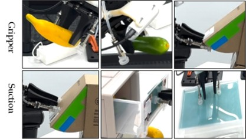
</p>
<p align="center"><em>Figure: Hybrid Coaxial Suction and Gripper End-Effector</em></p>

In addition to hardware design, recent advancements in mechatronics and intelligent robotics have enabled the integration of mechanical systems, electronics, embedded control, and computer vision into a single platform. Robotic arms commonly use actuators such as stepper motors and servos for position control, while microcontrollers and embedded computers such as Arduino and Raspberry Pi are used for coordination, sensing, and processing. At the same time, vision-guided robotics has become increasingly important. By integrating cameras with computer vision and artificial intelligence techniques, robots can identify, classify, and locate objects in real time, allowing more autonomous and adaptive operation.

This project builds on these technical foundations by developing a pick-and-place robot that integrates mechanical gripping, vacuum suction, sensors, camera-based detection, and embedded control into one mechatronic system.

---

# ● Methods

The project follows a structured engineering approach that moves from design to validation. It begins with system design, where the overall concept is developed and refined based on practical requirements and existing solutions. This is followed by simulation and analysis, where tools like SolidWorks are used to evaluate performance and ensure the design meets mechanical and functional needs. The system is then brought to life through prototyping and fabrication, using methods such as 3D printing and laser cutting to enable rapid iteration. Finally, electronics and control are integrated, combining hardware and software to achieve reliable operation.

○ [System Design](System_Design.md)

○ [Simulation and Analysis](Simulation_and_Analysis.md)

○ [Prototyping and Fabrication](Prototyping_and_Fabrication.md)

○ [Electronics and Control](Hardware_Integration.md)

---

# ● CAD Design

The robot was modeled in SolidWorks, covering all structural components including the base, shoulder, elbow, wrist, and end-effector. The CAD model was used to verify clearances, plan the assembly sequence, and generate STL files for 3D printing. The design was kept modular so individual parts could be reprinted and replaced without rebuilding the entire structure.

<p align="center">
  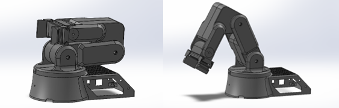
</p>
<p align="center"><em>Figure: CAD model — home position (left) and extended position (right)</em></p>

<p align="center">
  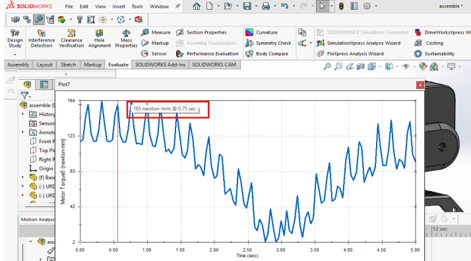
</p>
<p align="center"><em>Figure: SolidWorks torque simulation results</em></p>

- [CAD Files (SolidWorks)](CAD_SolidWorks.zip)
- [STEP File](assembly.STEP)
- [STL Files for 3D Printing](STL.zip)

---

# ● Gripper Design

The end-effector uses a hybrid design that combines a two-finger mechanical gripper with a vacuum suction cup. This allows the robot to handle a diverse range of objects: the mechanical gripper is used for rigid items like nuts and bolts, while the suction cup handles flat or smooth-surfaced objects like CDs or eggs. Both mechanisms are mounted coaxially so they can work independently without repositioning the arm.

<p align="center">
  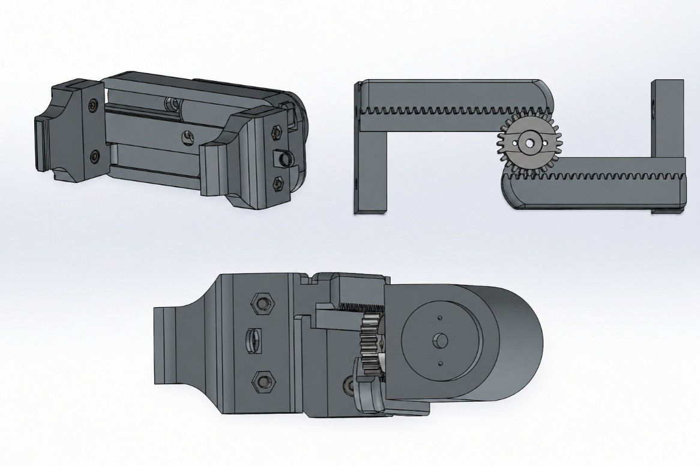
</p>
<p align="center"><em>Figure: Hybrid gripper design — mechanical fingers and suction cup</em></p>

The suction pump is controlled through a relay on Arduino pin D10. The commands `SUCTION_CUP_ON` and `SUCTION_CUP_OFF` energize and release the relay respectively. The gripper servo is driven by an SG90 micro servo, providing lightweight and precise open/close control.

---

# ● Kinematics

## Forward Kinematics (FK)

Forward kinematics was implemented and visualized in RViz using ROS 2. A URDF model of the robot was created from the SolidWorks geometry, defining all link lengths and joint axes. By specifying joint angles, the end-effector position can be computed and validated against the physical robot. This confirmed that the workspace is sufficient for the intended pick-and-place tasks and that the kinematic model matches the fabricated arm.

<p align="center">
  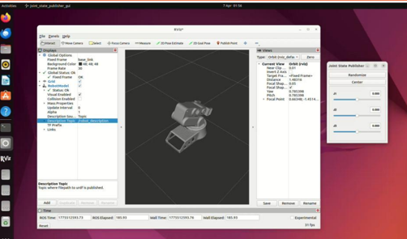
</p>
<p align="center"><em>Figure: Forward kinematics visualization in RViz</em></p>

## Inverse Kinematics (IK)

Inverse kinematics allows the robot to compute the required joint angles for a given end-effector position in Cartesian space. This is essential for autonomous pick-and-place operation where the target location is provided as an (x, y, z) coordinate by the vision system. IK was implemented and tested using MoveIt2, and the results were validated against the forward kinematics model.

<p align="center">
  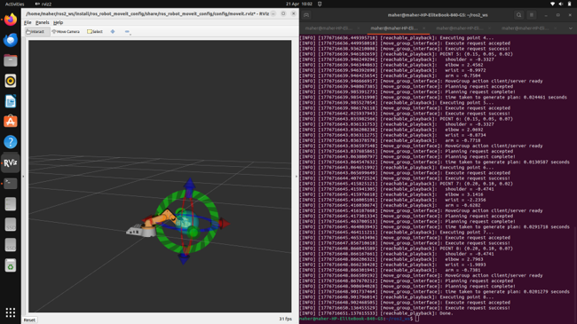
</p>
<p align="center"><em>Figure: Inverse kinematics solution in RViz / MoveIt2</em></p>

<p align="center">
  
</p>
<p align="center"><em>Figure: Robot motion simulation using the URDF model</em></p>

- [URDF file](Files/urdf.urdf)

---

# ● Electrical System

The electrical system connects all hardware subsystems: the Raspberry Pi (high-level processing), the Arduino (real-time motor control), the servo motors, the suction pump relay, and the motorized platform. Power distribution is handled with separate supplies for logic and motors to prevent interference.

<p align="center">
  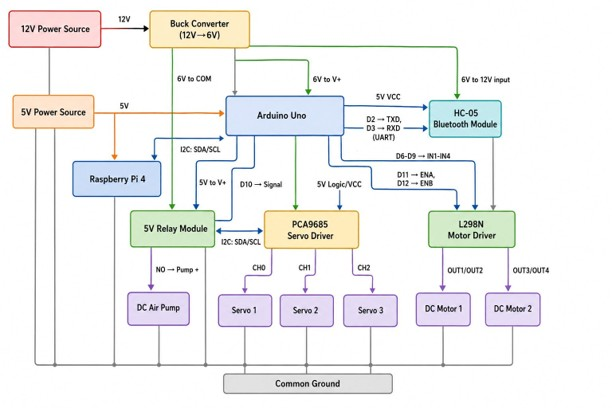
</p>
<p align="center"><em>Figure: Electrical block diagram</em></p>

<p align="center">
  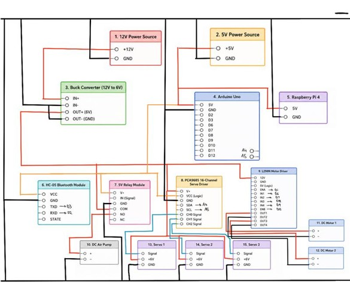
</p>
<p align="center"><em>Figure: Electrical schematic</em></p>

The actuation system uses:
- **MG995 servo motors** (270°) for base and shoulder joints
- **20 kg·cm high-torque servo** (270°) for the elbow joint
- **SG90 micro servo** (180°) for the gripper
- **Relay module** on Arduino D10 for suction pump control
- **HC-05 Bluetooth module** for optional wireless manual control

<div align="center">
  
  &nbsp;&nbsp;&nbsp;
  
  &nbsp;&nbsp;&nbsp;
  
</div>
<p align="center"><em>Figure: MG995 (left), 20 kg·cm High-Torque Servo (center), SG90 Micro Servo (right)</em></p>

---

# ● Computer Vision (Object Detection)

The vision pipeline runs YOLOv8 on a laptop for object detection and streams commands to the Raspberry Pi. A camera module connected to the Pi captures a live MJPEG video feed which is processed in real time to identify objects, estimate their position, and trigger the pick-and-place sequence.

○ [HSV and Colour Detection](Colour_Detection.md)

○ [Object Detection](Object_detection.md)

## Dataset and Annotation

A custom dataset was assembled and annotated with objects relevant to the pick-and-place task: eggs, nuts, and stress balls. Images were collected under different lighting conditions and annotated using bounding boxes.

<p align="center">
  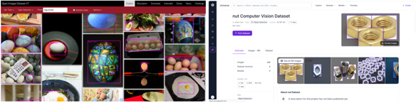
</p>
<p align="center"><em>Figure: Sample images from the custom egg and nut dataset</em></p>

<p align="center">
  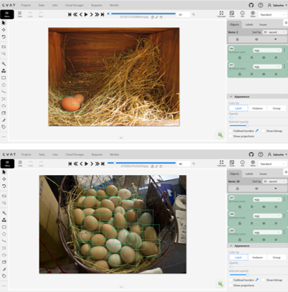
</p>
<p align="center"><em>Figure: Annotated bounding boxes on egg samples</em></p>

## Model Training

The YOLOv8 model was trained on the annotated dataset. Training was monitored using loss curves and precision/recall metrics. The final model (`best.pt`) achieved reliable detection of the target objects under varied lighting and background conditions.

<p align="center">
  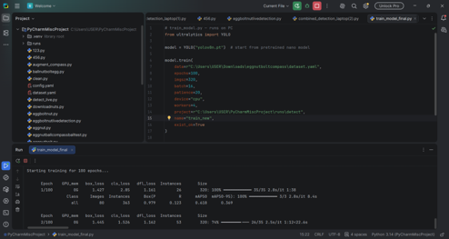
</p>
<p align="center"><em>Figure: YOLOv8 training results — loss and metrics over epochs</em></p>

## HSV Colour Calibration

HSV-based colour detection was used as an initial detection approach and for calibration purposes. The HSV colour space is more robust to lighting changes than RGB, making it well suited for detecting coloured objects in variable lab conditions.

<p align="center">
  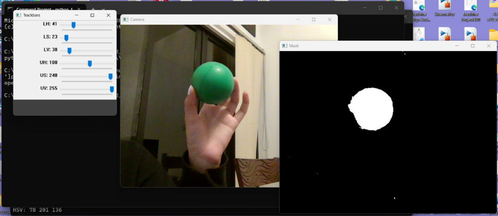
</p>
<p align="center"><em>Figure: HSV calibration interface for colour-based detection</em></p>

## Live Detection on Raspberry Pi

After training, the model was deployed on the Raspberry Pi pipeline. The laptop runs `laptop_yolo_sender.py` which processes the MJPEG stream, detects objects in real time, and sends position data to the Pi receiver over TCP.

<p align="center">
  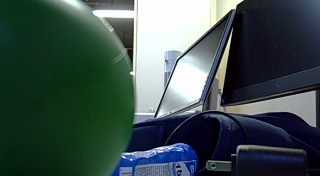
</p>
<p align="center"><em>Figure: Camera test frame from the Raspberry Pi stream</em></p>

<p align="center">
  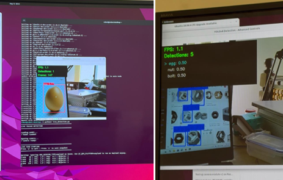
</p>
<p align="center"><em>Figure: Real-time YOLOv8 detection running in the pipeline</em></p>

---

# ● Interactive Website

A web-based control interface was developed to allow both manual and autonomous control of the robot. The website connects to the robot either over USB serial, Bluetooth (HC-05), or via the Raspberry Pi network bridge, allowing full remote control of all joints, the gripper, and the platform.

**Key features:**
- Joint sliders with real-time calibrated angle conversion for elbow and wrist
- Platform directional controls (forward, backward, left, right, stop)
- Suction cup on/off toggle
- Home and emergency stop buttons
- Autonomous tracking mode toggle (delegates control to the Pi receiver)
- Live camera feed embedded in the interface

<p align="center">
  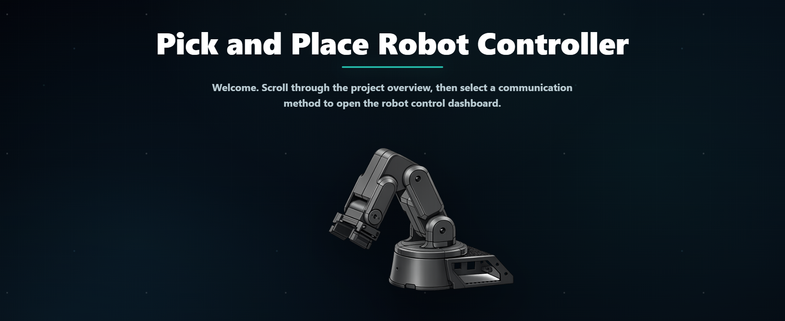
</p>
<p align="center"><em>Figure: Website — main control panel</em></p>

<p align="center">
  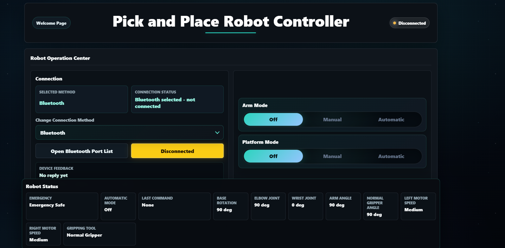
</p>
<p align="center"><em>Figure: Website — joint control and camera feed</em></p>

<p align="center">
  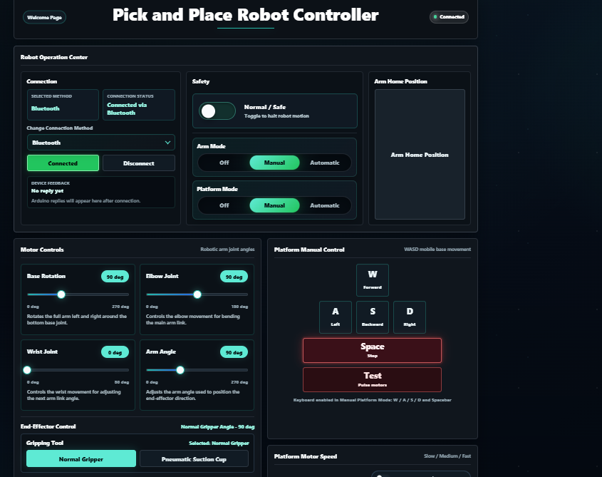
</p>
<p align="center"><em>Figure: Website — platform and connection settings</em></p>

<p align="center">
  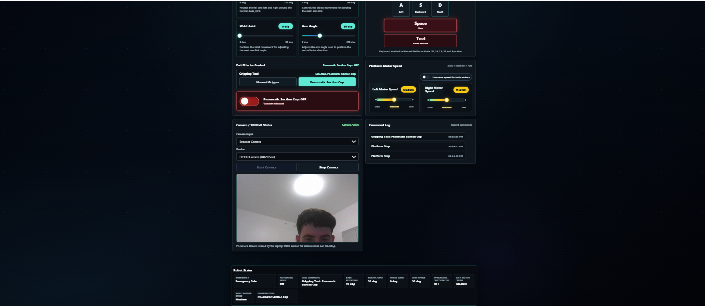
</p>
<p align="center"><em>Figure: Website — autonomous mode interface</em></p>

To run the website locally:

```bash
cd "Website/arm-controller"
npm install
npm run dev
```

Then open `http://localhost:5173` in Chrome or Edge (required for Web Serial).

---

# ● Testing and Validation

○ [Testing Procedure](Testing_Procedure.md)

○ [Data Collection](Data_Collection.md)

○ [Evaluation Criteria](Evaluation_Criteria.md)

---

# ● Results

The system was fully integrated and tested end-to-end. The laptop detects objects in the camera stream using YOLOv8, sends position data to the Raspberry Pi over TCP, and the Pi sends joint commands to the Arduino which drives the arm and platform motors in real time. Manual override is available at all times through the website.

### Key Results Summary

| Component | Status | Outcome |
|----------|--------|--------|
| CAD Design | Completed | Validated geometry and structure |
| Torque Analysis | Completed | Confirmed motor selection is sufficient |
| Fabrication | Completed | Arm assembled and tested |
| Computer Vision (HSV) | Completed | Basic object detection achieved |
| Computer Vision (YOLOv8) | Completed | Real-time detection on Raspberry Pi |
| ROS 2 (FK/IK) | Completed | URDF model working in RViz and MoveIt2 |
| Hardware Integration | Completed | Arduino, Pi, and laptop fully connected |
| Interactive Website | Completed | Web-based manual and autonomous control |
| Pick-and-Place Pipeline | Completed | End-to-end autonomous operation demonstrated |

---

# ● Discussion

The results indicate that the project was completed in a structured and iterative manner, with strong alignment between design, simulation, and implementation. The successful validation of motor torque requirements confirms that the chosen actuators are appropriate and the robot operates without overloading any joint.

The use of both classical computer vision (HSV detection) and modern deep learning approaches (YOLOv8) provides flexibility in object detection strategies. While HSV detection offers simplicity and low computational cost, it is sensitive to lighting conditions. In contrast, YOLOv8 demonstrates more robust detection but requires more computational resources. Offloading inference to the laptop while the Pi handles control bridging proved to be an effective architecture for this constraint.

The hybrid gripper design successfully handles both rigid objects (nuts, bolts) and delicate objects (eggs) without hardware changes, validating the core design decision to combine mechanical gripping with vacuum suction in a single coaxial end-effector.

The interactive website proved valuable not only as a manual control interface but also as a debugging and calibration tool during system integration.

### Key Challenges and Limitations

| Challenge | Impact | Mitigation |
|----------|--------|-----------|
| Limited lab access | Delayed prototyping | Focus on simulation and software |
| High cost of components | Slower decision-making | Careful analysis before selection |
| Long YOLO training time | Delayed testing cycles | Dataset optimization and iteration |
| Team coordination constraints | Reduced collaboration | Increased virtual meetings |

---

# ● Project Management Summary

The project was organized using a structured team-based approach. Tasks were divided among members based on key areas such as mechanical design, sensors, and control systems.

The team followed clear milestones, starting from research and concept development to CAD design and preparation for prototyping. Regular meetings were held to track progress, discuss challenges, and make design decisions.

## ○ Gantt Chart
[View the updated Gantt Chart](https://studentsaduac-my.sharepoint.com/:x:/g/personal/1087993_students_adu_ac_ae/IQCVl5X-gnVOTbJbda9AOzVBAQxvkQVJ4Exoq-0edEJwLJE?e=tAfXTX&wdLOR=cD9B9CDF9-E9B2-46DC-981F-AE0154DF6142)

---

# ● Code and Software

○ [Computer Vision Scripts](Computer_Vision/) — YOLO sender, Raspberry Pi receiver, arm calibration

○ [Arduino Sketch](Arduino/2_motors_arduino_noross.ino) — Motor and gripper control

○ [Interactive Website](Website/arm-controller/) — Web-based robot control interface

○ [YOLO Training Results](Computer_Vision/Training_Results/train27/) — Model weights and metrics

○ [Dataset Labels](Dataset/labels/) — Annotated training labels

---

# ● Appendix

○ [Progress Report - Week 2](Files/Progress-W2.pdf)

○ [Progress Report - Week 3](Files/Progress-W3.pdf)

○ [Progress Report - Week 4](Files/Progress-W4.pdf)

○ [Progress Report - Week 5](Files/Progress-W5.pdf)

○ [Progress Report - Week 5 (slides)](Files/Progress-W5.pptx)

○ [Progress Report - Week 6](Files/Progress-W6.pdf)

○ [Progress Report - Week 6 (slides)](Files/Progress-W6.pptx)

○ [Progress Report - Week 7 (slides)](Files/Progress-W7.pptx)

○ [Progress Report - Week 8 (slides)](Files/Progress-W8.pptx)

○ [Progress Report - Week 10](Files/Progress-W10.pdf)

○ [Progress Report - Week 11 (slides)](Files/Progress-W11.pptx)

○ [Progress Report - Week 12 (slides)](Files/Progress-W12.pptx)
